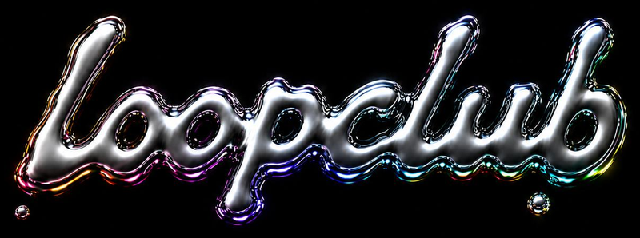

# loop club — landing page

The marketing landing for **loopclub.xyz**. A single-screen hero over a
full-bleed animated step-sequencer backdrop, with a `launch app` CTA that
opens the product at `app.loopclub.xyz`.

> Rebrand note: the product was *loopchain*; the new name is **loopclub**
> (domain `loopclub.xyz`). This page uses the new name throughout.

## Files

```
index.html      — markup (hero, header, footer)
styles.css      — all styling; design-system tokens inlined at the top
backdrop.js     — canvas animation (the living sequencer grid)
assets/fonts/   — Gilroy (display) — 7 cuts, self-hosted
assets/og-cover.png — social share card (1200×630)
```

Space Mono (the product/chrome font) loads from Google Fonts. Everything
else is local — no build step, no dependencies.

## Run / deploy

It's a static site. Locally:

```bash
python3 -m http.server 8000   # then open http://localhost:8000
```

Deploy by dropping the folder on any static host (Cloudflare Pages fits the
existing Cloudflare setup). DNS:

- `loopclub.xyz` → this landing page
- `app.loopclub.xyz` → the loopclub frontend app

The CTA buttons already point at `https://app.loopclub.xyz`.

## The backdrop

`backdrop.js` renders a live step sequencer: a grid of LED cells with a
playhead sweeping across it, lighting beats in their track colour as it
passes — and the pattern quietly mutates as it runs, so it reads as a loop
being *written*. It's the product itself, breathing, behind the hero.
`prefers-reduced-motion` is honoured (renders one static frame).

## Design system

Visual tokens (colours, the liquid-chrome gradients, type scale, spacing)
are lifted verbatim from the loopclub design system
(`loopclub-design-system/design-system/tokens/*`). They're inlined into the
top of `styles.css` so this page stays a self-contained deployable. If a
token changes upstream, update the `:root` block in `styles.css` to match.

## Logo

The header wordmark is the liquid-chrome `loopclub` PNG at
`assets/logo.png` (sized via `.brand-logo` in `styles.css`). To feature
the logo large in the hero, add right above the `<h1>`:

```html

```

The CSS placeholder wordmark classes (`.wordmark`, `.wordmark--sm`,
`.wordmark--hero`) are still defined for fallback / hero use. Re-run the
og-cover screenshot if the social card needs to match.
